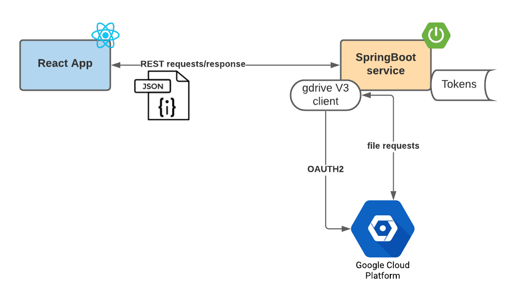
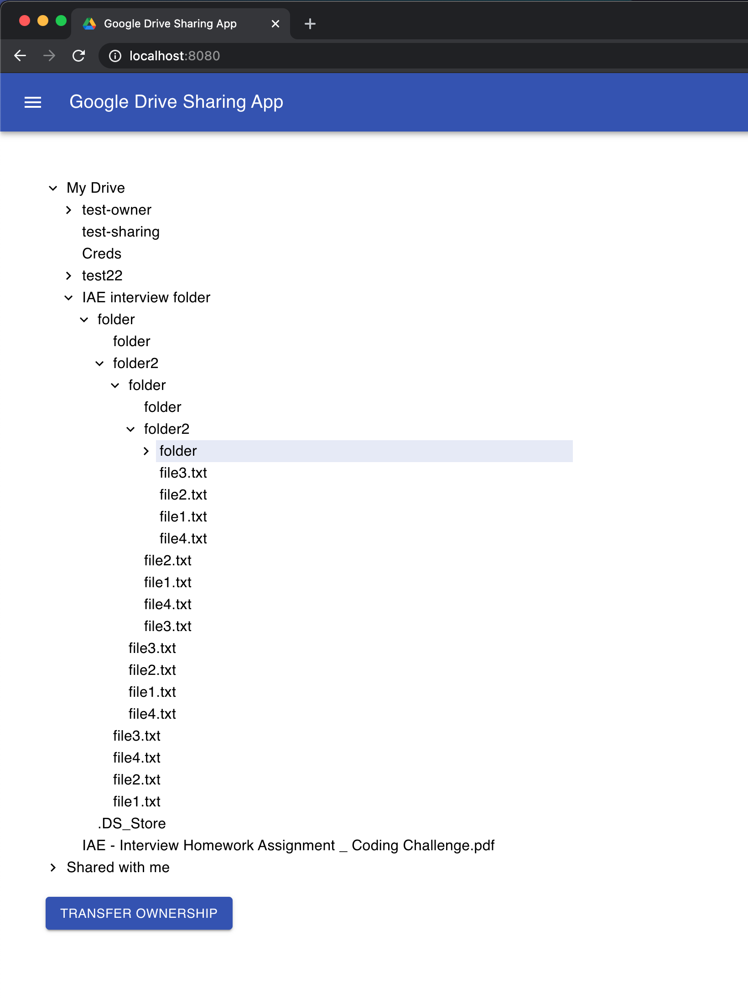
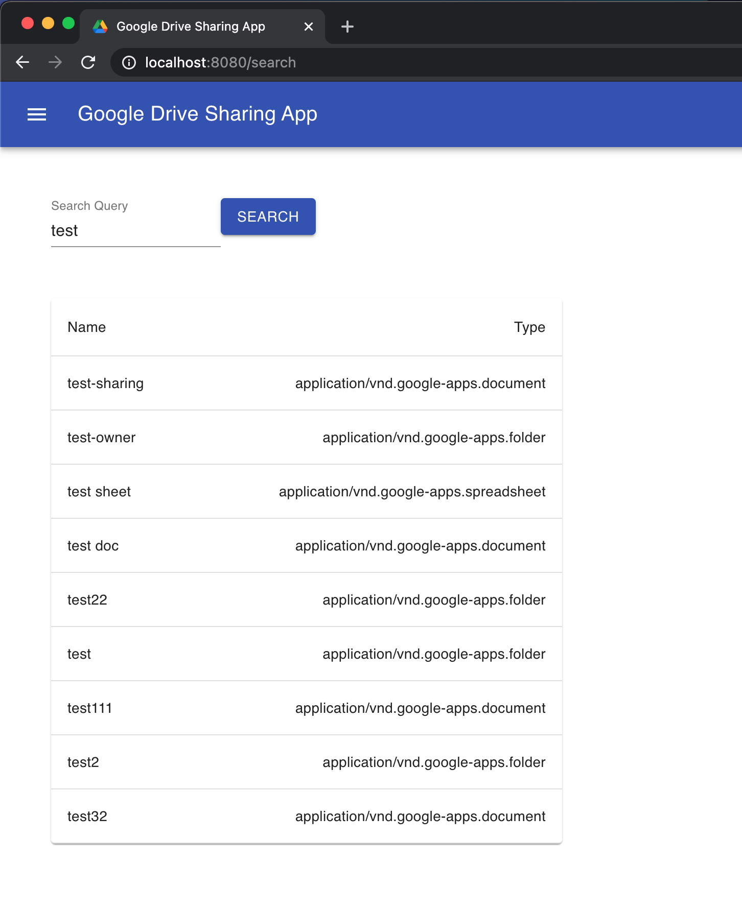
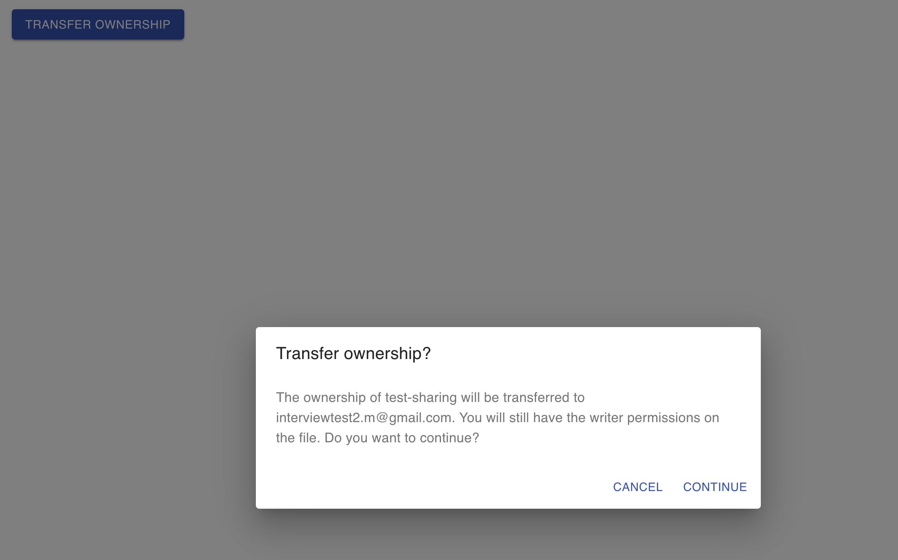
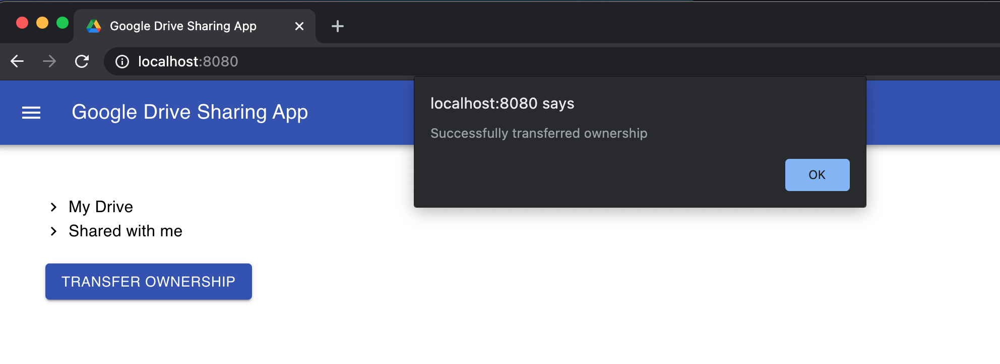

# Google drive sharing app
Google Drive allows users to store files in the cloud, synchronize files across devices and share
files with users and google groups. It also allows to create the nested directory structure and
upload files to any part of the directory structure. Further, one can share files and folders either
specific files/folders or the entire folder (including all files and nested folders) with other users
and groups.
Given a predefined folder structure (folder name: IAE Interview Folder) for 
“interviewtest1.m@gmail.com” account which contains files and nested folders, the task was to create 
an interactive java application with certain features listed below.

This is an interactive Java application developed using Spring Boot and React. It 
uses [gdrive v3 client](https://developers.google.com/drive/api/v3/quickstart/java) to integrate 
with Google drive. Users is required to authenticate using Auth2, provide permissions of their drive before they can 
access the drive resources. Following features are currently implemented:  
1. Browse google drive of an account. Currently, the test account “interviewtest1.m@gmail.com” is integrated. 

2. Users can select a resource (file/folder) and transfer the ownership to another user. Currently the user  "interviewtest2.m@gmail.com"
is used as a "transfer-to" account. The ownership transfer applies to all the resources under the selected folder. If 
user doesn't own a resource, it is not used in the transfer. 

4. Search for a file or folder by exact name match and partial match. The current implementation uses "contains" [query 
term](https://developers.google.com/drive/api/v3/ref-search-terms). 

## Demo
A working application has been deployed in [Heroku](https://gdrive-sharing-app.herokuapp.com/). Please navigate to https://gdrive-sharing-app.herokuapp.com/ to 
see it in action.    

The app has already been authenticated for the tester account and holds/refreshes the token. 

## Prerequisites
1. Java 8
2. Gradle 6.5+
3. Node v15+

## Design

## Installation
1. Clone the repo  
`git clone git@github.com:mimansha-gdrive/iae-sharing-app.git` 

2. Build  
`cd sharing-app`  
`./gradlew clean build`

3. Run  
`cd sharing-app`  
`./gradlew bootRun`  
Navigate to http://localhost:8080/

## Running the tests
The tests run automatically as part of Gradle build. They can be run explicitly using 
`./gradlew test`

## Built With
* [Spring Boot](https://spring.io/projects/spring-boot) - The web framework used
* [Gradle](https://gradle.org/) - Dependency Management
* [React](https://reactjs.org/) - User Interface

## Screenshots
* Browse Google drive

* Search resources (files/folders) by name

 
* Transfer ownership

* Transfer ownership response
 